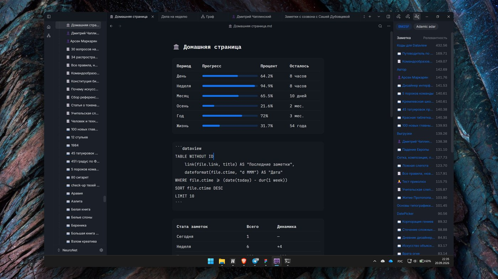
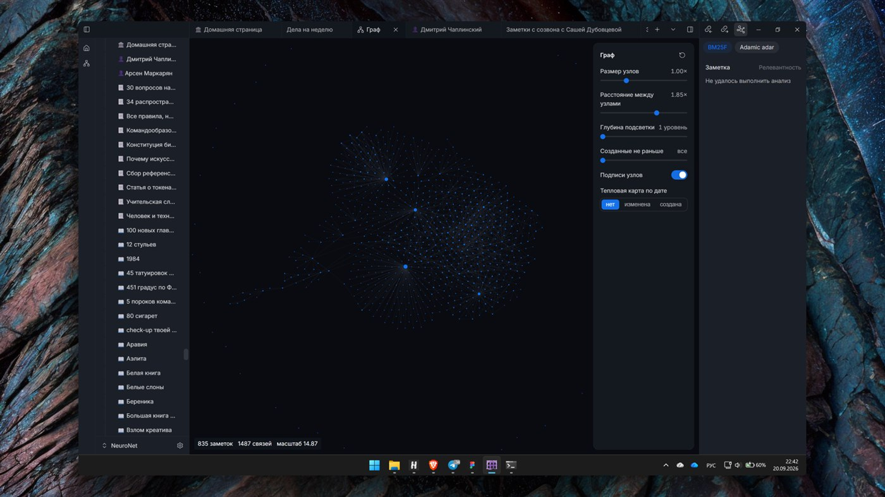
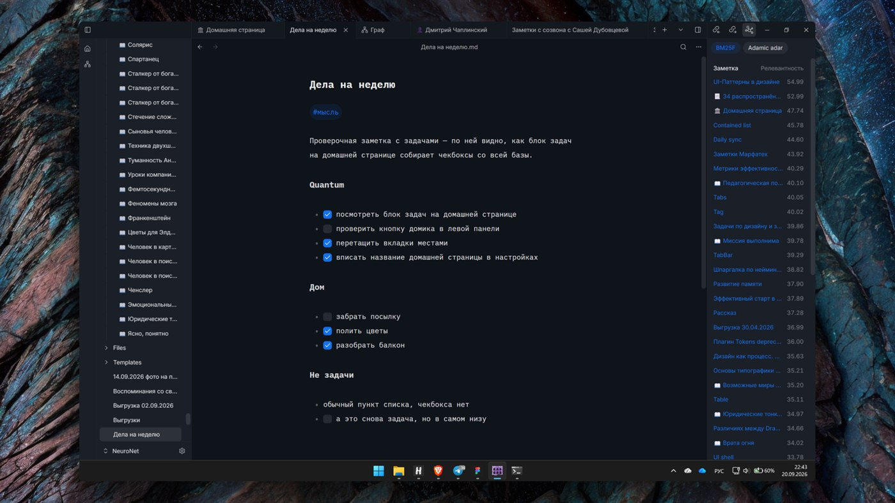
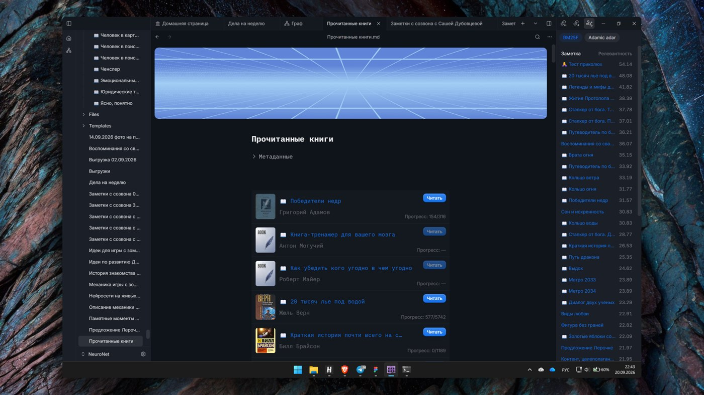
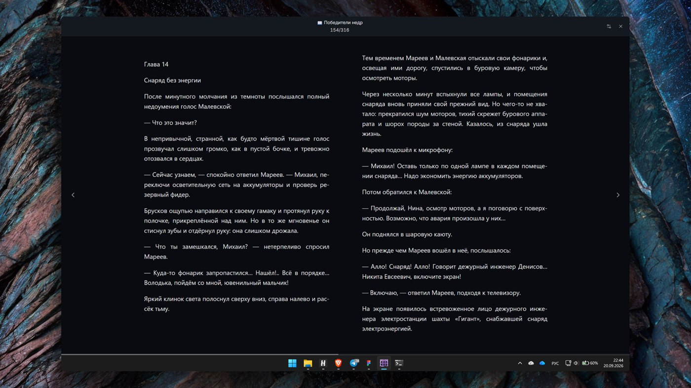
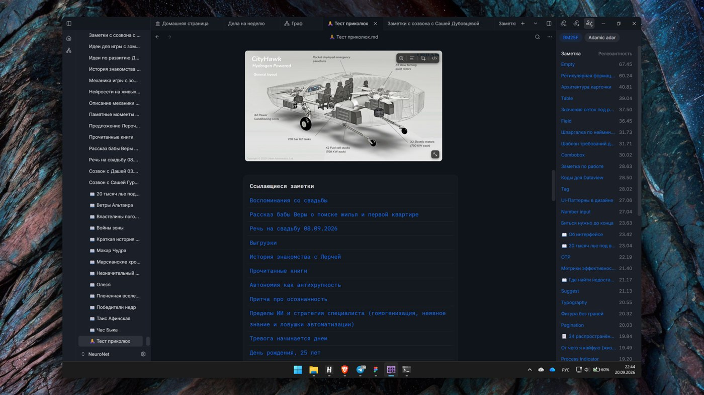
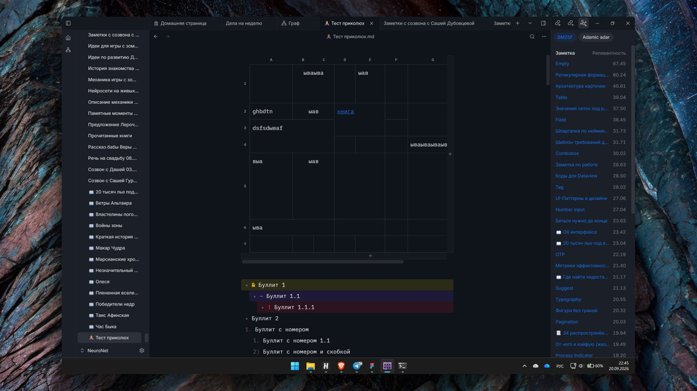
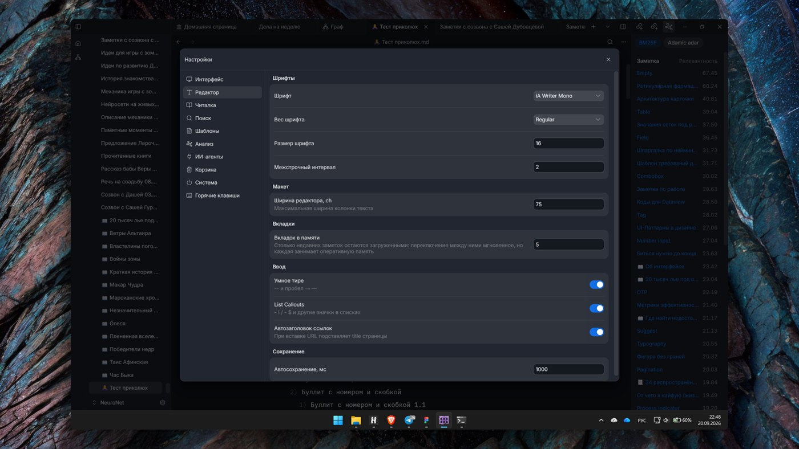

<p align="center">
  
</p>

<h1 align="center">Quantum</h1>

<p align="center">
  Быстрый локальный редактор заметок и база знаний для Windows.<br>
  Ваши записи — обычные markdown-файлы в папке на диске.
</p>

<p align="center">
  <a href="https://github.com/Freaction/Quantum-release/releases/latest">Скачать последнюю версию</a>
</p>

<p align="center">
  <a href="README.md">English</a> · <b>Русский</b>
</p>

---

## Что это

Quantum — десктопное приложение для личной базы знаний: заметки, ссылки между ними,
поиск, чтение книг и работа с метаданными. Никакого облака и аккаунта: приложение
открывает выбранную вами папку и работает с лежащими в ней `.md` файлами напрямую.
Файлы остаются читаемыми любым другим редактором, а если Quantum вам разонравится —
заметки никуда не денутся и не потребуют экспорта.

Приложение собрано на Tauri: интерфейс на React, вся работа с диском, индексом и
поиском — на Rust. Отсюда и главное свойство — скорость: открытие заметки, поиск и
переключение вкладок должны быть мгновенными на базе любого размера.

## Как это выглядит

**Домашняя страница: вся база одним взглядом**

Блок ```` ```dataview ```` собирает таблицы прямо в заметке — последние записи, сколько прошло
от дня, месяца и года, сколько заметок написано за неделю по сравнению с прошлой. Всё считается
внутри приложения, без плагинов и без JavaScript.



**Граф связей**

Все заметки и все ссылки на одном полотне — здесь 835 заметок и 1487 связей. Размер узлов,
расстояние между ними, глубина подсветки и тепловая карта по дате настраиваются на ходу.



**Задачи**

Чекбоксы настоящие: щёлкнули — задача закрылась прямо в тексте. Запрос `TASK` собирает
незакрытые дела со всей базы в один блок, где бы они ни были записаны.



**Книги и читалка**

Страница книги хранит обложку, автора и прогресс чтения, а «Читать» открывает встроенную
читалку: две колонки, выключка по ширине, переносы. Позиция и выделенные цитаты сохраняются
обратно в заметку.





**Ссылки, обратные ссылки и релевантность**

Вики-ссылки, список заметок, которые ссылаются сюда, и панель подсказок: BM25F ранжирует по
словам запроса, Adamic–Adar — по форме графа связей.



**Таблицы и списки**

Markdown-таблица ведёт себя как таблица: строки и колонки перетаскиваются, ячейки объединяются,
ссылки внутри остаются живыми. Списки умеют вложенность, нумерацию и цветные пометки.



**Настройки**

Шрифт, кегль, межстрочный интервал и ширина колонки — отдельно для редактора и для читалки.



## Возможности

**Редактор**

- Живой предпросмотр markdown: разметка видна только там, где стоит каретка, остальной текст выглядит как готовый документ.
- Таблицы с объединением ячеек, перетаскиванием строк и колонок, изменением ширины.
- Изображения и видео прямо в тексте, вставка перетаскиванием в папку хранилища.
- Блоки кода с подсветкой, цитаты, callout-блоки, списки с перемещением по Alt+стрелкам.
- Метаданные (frontmatter) сворачиваются в аккуратный блок и редактируются как поля.
- Шаблоны заметок: свои заготовки для новых страниц.

**Связи и навигация**

- Вики-ссылки `[[Заметка]]`, обратные ссылки и список исходящих связей.
- Граф связей, который обновляется вместе с правками.
- Вкладки, история переходов «назад/вперёд», оглавление документа.
- Несколько хранилищ: каждая папка со своим индексом, переключение без перемешивания данных.

**Поиск**

- Полнотекстовый поиск по всей базе на движке Tantivy — результаты появляются во время набора.
- Поиск по открытой странице с подсветкой совпадений.
- Поля метаданных лежат в индексе типизированными, поэтому выборки по ним быстрые.

**Запросы к базе**

Блок ```` ```dataview ```` собирает таблицы и списки заметок по условиям: `TABLE` и `LIST`
с частями `FROM`, `WHERE`, `SORT`, `LIMIT`, полями файла и набором функций. Синтаксис
снаружи повторяет DQL из Obsidian, чтобы запросы переносились без переписывания, а
считается всё на стороне Rust.

**Книги**

- Встроенная читалка EPUB, MOBI, AZW3 и FB2 — файл лежит в том же хранилище.
- Страница книги с обложкой, автором, статусом и прогрессом чтения.
- Выделенный в читалке фрагмент отправляется цитатой в заметку.

**Оформление и вывод**

- Светлая и тёмная темы, настройка шрифтов и масштаба интерфейса.
- Обложки страниц и миниатюры.
- Экспорт заметки в PDF формата A4 — тем же оформлением, что и на экране.
- Русский и английский интерфейс.

**Для агентов**

Встроенный MCP-сервер даёт ИИ-агентам доступ к базе: чтение, поиск, создание и правку
заметок, работу со ссылками и метаданными. Правки агента и ваш ввод сливаются, а не
затирают друг друга: документ живёт в CRDT-модели, поэтому текст под кареткой не
теряется, пока агент пишет в тот же файл.

## Установка

1. Откройте [последний релиз](https://github.com/Freaction/Quantum-release/releases/latest).
2. Скачайте `quantum-app_<версия>_x64-setup.exe`.
3. Запустите установщик.

Приложение ставится в профиль пользователя и не просит прав администратора.
Установщик не подписан сертификатом Windows, поэтому SmartScreen может показать
предупреждение — «Подробнее» → «Выполнить в любом случае».

При первом запуске выберите папку под хранилище: пустую для новой базы или уже
существующую с вашими markdown-файлами.

## Обновления

Quantum обновляется сам. При запуске приложение сверяется с этим репозиторием, и если
вышла новая версия — скачивает и ставит её, показывая ход загрузки, после чего
перезапускается. Все обновления подписаны ключом разработчика и проверяются до
установки. Если сети нет, приложение просто запускается как обычно.

Ставить новую версию поверх старой руками не нужно.

## Требования

- Windows 10 или 11, 64-разрядная.
- WebView2 — он есть в системе по умолчанию, а если нет, установщик его дотянет.

Сборки для macOS и Linux пока не выпускаются.

## Ваши данные

Всё лежит у вас на диске:

- заметки — `.md` файлы в выбранной папке, ровно там, где вы их видите;
- вложения — в папке хранилища рядом с заметками;
- поисковый индекс, позиции прокрутки и закладки читалки — служебные кэши, которые
  всегда можно удалить: они соберутся заново из ваших файлов.

Приложение ничего не отправляет на сервер. В сеть оно ходит только за обновлением и —
если вы сами включите анализ источников — за статьями Wikipedia.

## Обратная связь

Ошибки и пожелания — во вкладке [Issues](https://github.com/Freaction/Quantum-release/issues).
Полезно указать версию приложения — она есть в настройках, раздел «Система» → «О программе», — и что происходило перед сбоем.

## Об этом репозитории

Здесь публикуются только готовые сборки и манифест автообновления. Исходный код
приложения лежит в отдельном закрытом репозитории.
